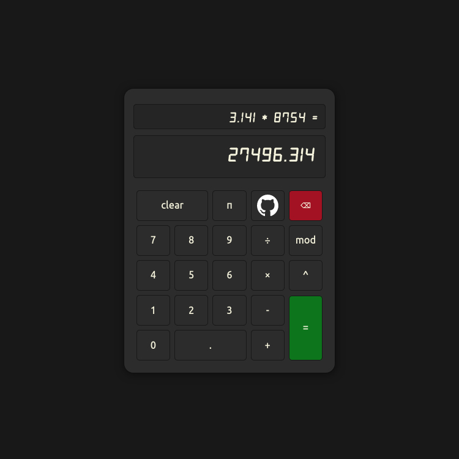

 
<h1>A calculator</h1>

<em>calculating simple stuff, I must say.</em>

Heavly inspired by the GNOME Calculator.
Done on a procedural approach. I think with OOP should be much more powerful.
Proyect assignment from [The Odin Proyect](https://www.theodinproject.com/lessons/foundations-calculator)

## Implementations

- Keyboard Support for all commands and operations (`${%}` is modulo and `${Supr}` is clearAll)
- Obviously: Add, Substract, Multiply, Divide, Factor, and Modulo operations.
- Backspace at any moment, even past mid operation.
- Can add float to any number
- If a result is active on memory, you can work with that result if applying any other operator, if any other number is press, previous result is cleared out.
- π button
- Add, Substract, Multiply, Divide, Factor, and Modulo operations. 